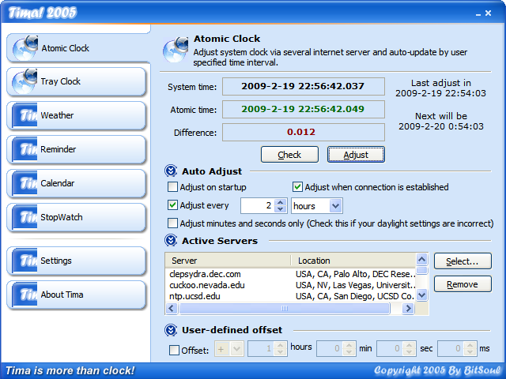

# Tima!

Tima! 是一款 Windows 系统常用工具集，计划的功能包括：

+ 原子钟对时
+ 系统托盘时间显示增强
+ 天气信息查询
+ 事项提醒
+ 万年历
+ 秒表

原子钟对时功能开发完成，其它功能尚未开发。

Tima! 在 2005 年使用 Visual Studio 2005 开发。

主要的技术特点有：

+ 异形窗口，全自绘用户界面
+ NTP 协议处理
+ 多线程处理
+ 支持简单 HTML 标记的文本渲染类
+ 系统托盘窗口 Hook
